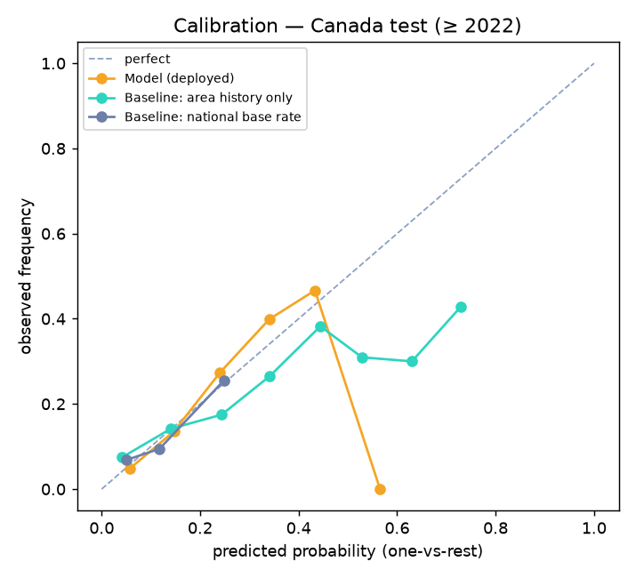

# Flowline Hazard Forecast — Model Report

Generated by `scripts/evaluate.py` on 2026-10-05. Forecasts are based on historical public incident data. Flowline supports engineering judgment; it does not certify any pipe as safe.

## 0. Conclusion (plain words)
- **Canada:** the deployed model **beats** the best baseline (*Baseline: province base rate*) on log loss: Δ = -0.154, 95% CI [-0.198, -0.109] (n = 430).
- **Alberta:** the deployed model **beats** the best baseline (*Baseline: national base rate*) on log loss: Δ = -0.081, 95% CI [-0.139, -0.022] (n = 164).
- **Add weather back, Canada:** no measurable difference (Δ log loss deployed − variant = +0.003, 95% CI [-0.022, +0.029]).
- **Add weather back, Alberta:** no measurable difference (Δ log loss deployed − variant = +0.005, 95% CI [-0.034, +0.043]).
- **Remove area history, Canada:** area history helps (Δ log loss deployed − variant = -0.089, 95% CI [-0.121, -0.056]).
- **Remove area history, Alberta:** area history helps (Δ log loss deployed − variant = -0.068, 95% CI [-0.124, -0.012]).
- **Weather is not a forecast input** (decision 2026-10-05). A weather signal exists in the raw data (§6: post-2022 Alberta washouts followed wetter months than other incidents), but the model cannot learn it from the training years, when geotechnical incidents were rare in Alberta. It is shown as an observed pattern, not a forecast. Backlog: *Washout watch* (rainfall anomaly, waterway crossings), judged only on the rolling-origin check.

## 1. Data and features

- Incidents in the database: 2,034; forecast-target incidents: 1,937 (Other / unknown and Undetermined are excluded from the target).

- Deployed model features (22): **location_time** (5); **context** (3); **area_history** (14). Weather (12 features) is evaluated as a rejected variant only.

- Weather coverage on target incidents (variant only): temperature 91.5%, all weather features 87.9% (missing stays missing).

- Area history: incidents strictly before the event date within 25 km; the hazard mix uses only incidents **closed** before the event date (cause known then), each site weighted once (sites = 1 km leader clusters).

- Leakage guards are enforced in code and tested (`tests/test_features.py`).

## 2. Main result — time split

Train: events ≤ 2021 (1507 incidents, national). Test: events ≥ 2022 (430 national, 164 Alberta). Point estimate with 95% bootstrap CI (1,000 resamples of test incidents).

Baselines: *national base rate* = training-period hazard mix for every incident; *province base rate* = the incident's own province mix (for Alberta this is the Alberta base rate), smoothed toward national with 10 pseudo-incidents; *area history only* = site-weighted prior mix within 25 km, smoothed with 2 pseudo-sites.

### Canada

| predictor | log loss ↓ | Brier ↓ | top-1 acc ↑ | top-3 acc ↑ |
|---|---|---|---|---|
| Baseline: national base rate | 1.949 [1.889, 2.011] | 0.839 [0.823, 0.857] | 0.223 [0.184, 0.265] | 0.570 [0.516, 0.619] |
| Baseline: province base rate | 1.948 [1.880, 2.019] | 0.835 [0.819, 0.852] | 0.223 [0.184, 0.260] | 0.660 [0.612, 0.705] |
| Baseline: area history only | 2.014 [1.921, 2.123] | 0.850 [0.822, 0.883] | 0.305 [0.258, 0.347] | 0.595 [0.544, 0.642] |
| Model (deployed) | 1.794 [1.728, 1.864] | 0.788 [0.768, 0.808] | 0.363 [0.319, 0.409] | 0.719 [0.674, 0.760] |
| Model + weather (rejected) | 1.791 [1.713, 1.867] | 0.783 [0.759, 0.804] | 0.365 [0.319, 0.414] | 0.716 [0.670, 0.760] |
| Model − area history | 1.883 [1.817, 1.954] | 0.816 [0.796, 0.836] | 0.305 [0.260, 0.349] | 0.663 [0.612, 0.709] |

Paired differences vs the best baseline (**Baseline: province base rate**):

| predictor − Baseline: province base rate | Δ log loss | Δ Brier | Δ top-1 | Δ top-3 |
|---|---|---|---|---|
| Baseline: national base rate | +0.001 [-0.039, +0.039] | +0.004 [-0.005, +0.013] | +0.000 [-0.028, +0.028] | -0.091 [-0.128, -0.053] ❌ |
| Baseline: area history only | +0.066 [-0.018, +0.150] | +0.016 [-0.011, +0.044] | +0.081 [+0.023, +0.142] ✅ | -0.065 [-0.109, -0.019] ❌ |
| Model (deployed) | -0.154 [-0.198, -0.109] ✅ | -0.046 [-0.062, -0.031] ✅ | +0.140 [+0.084, +0.193] ✅ | +0.058 [+0.028, +0.091] ✅ |
| Model + weather (rejected) | -0.157 [-0.207, -0.111] ✅ | -0.052 [-0.070, -0.036] ✅ | +0.142 [+0.084, +0.200] ✅ | +0.056 [+0.026, +0.088] ✅ |
| Model − area history | -0.065 [-0.105, -0.025] ✅ | -0.019 [-0.033, -0.007] ✅ | +0.081 [+0.037, +0.130] ✅ | +0.002 [-0.026, +0.030] |

✅ = better than the reference with the 95% CI excluding zero; ❌ = worse with the CI excluding zero; blank = not distinguishable.

### Alberta only (same models, Alberta test incidents)

| predictor | log loss ↓ | Brier ↓ | top-1 acc ↑ | top-3 acc ↑ |
|---|---|---|---|---|
| Baseline: national base rate | 1.944 [1.839, 2.037] | 0.830 [0.801, 0.855] | 0.305 [0.238, 0.372] | 0.567 [0.494, 0.640] |
| Baseline: province base rate | 1.995 [1.890, 2.093] | 0.841 [0.812, 0.866] | 0.305 [0.238, 0.372] | 0.567 [0.494, 0.640] |
| Baseline: area history only | 2.153 [2.003, 2.294] | 0.903 [0.861, 0.943] | 0.213 [0.152, 0.280] | 0.537 [0.463, 0.616] |
| Model (deployed) | 1.862 [1.749, 1.973] | 0.806 [0.774, 0.835] | 0.329 [0.262, 0.409] | 0.652 [0.579, 0.732] |
| Model + weather (rejected) | 1.858 [1.735, 1.971] | 0.807 [0.773, 0.838] | 0.293 [0.226, 0.366] | 0.677 [0.604, 0.750] |
| Model − area history | 1.931 [1.810, 2.051] | 0.819 [0.787, 0.851] | 0.311 [0.244, 0.384] | 0.628 [0.549, 0.707] |

Paired differences vs the best Alberta baseline (**Baseline: national base rate**):

| predictor − Baseline: national base rate | Δ log loss | Δ Brier | Δ top-1 | Δ top-3 |
|---|---|---|---|---|
| Baseline: province base rate | +0.051 [+0.030, +0.071] ❌ | +0.011 [+0.007, +0.015] ❌ | +0.000 [+0.000, +0.000] | +0.000 [+0.000, +0.000] |
| Baseline: area history only | +0.210 [+0.085, +0.323] ❌ | +0.073 [+0.036, +0.110] ❌ | -0.091 [-0.177, -0.012] ❌ | -0.030 [-0.098, +0.043] |
| Model (deployed) | -0.081 [-0.139, -0.022] ✅ | -0.024 [-0.045, -0.004] ✅ | +0.024 [-0.055, +0.110] | +0.085 [+0.030, +0.146] ✅ |
| Model + weather (rejected) | -0.086 [-0.148, -0.025] ✅ | -0.023 [-0.047, -0.001] ✅ | -0.012 [-0.085, +0.073] | +0.110 [+0.055, +0.165] ✅ |
| Model − area history | -0.013 [-0.061, +0.035] | -0.010 [-0.027, +0.007] | +0.006 [-0.055, +0.067] | +0.061 [+0.024, +0.098] ✅ |

✅ = better than the reference with the 95% CI excluding zero; ❌ = worse with the CI excluding zero; blank = not distinguishable.

## 3. Rolling-origin check

Each row trains on all years before the test year (national) and tests on that year only. Early stopping uses the last training year, never the test year.

| test year | n | n AB | model log loss [CI] | national base | area history | Δ model − national [CI] | top-3 model / national | AB log loss model / national |
|---|---|---|---|---|---|---|---|---|
| 2020 | 90 | 39 | 2.041 [1.860, 2.225] | 2.204 | 2.266 | -0.163 [-0.269, -0.062] | 0.56 / 0.43 | 1.958 / 2.099 |
| 2021 | 135 | 43 | 2.131 [1.999, 2.279] | 2.224 | 2.346 | -0.093 [-0.169, -0.026] | 0.57 / 0.40 | 2.054 / 2.143 |
| 2022 | 141 | 52 | 1.795 [1.668, 1.915] | 1.996 | 2.056 | -0.201 [-0.286, -0.119] | 0.69 / 0.55 | 1.818 / 1.962 |
| 2023 | 132 | 49 | 1.655 [1.516, 1.806] | 1.884 | 1.820 | -0.229 [-0.313, -0.143] | 0.73 / 0.64 | 1.911 / 2.006 |
| 2024 | 64 | 27 | 1.992 [1.744, 2.253] | 2.020 | 2.146 | -0.028 [-0.210, +0.171] | 0.67 / 0.45 | 1.923 / 1.993 |
| 2025 | 70 | 29 | 1.682 [1.535, 1.828] | 1.788 | 2.084 | -0.106 [-0.205, -0.010] | 0.77 / 0.81 | 1.719 / 1.706 |

## 4. Ablation — do weather and area history help?

Δ = log loss of the deployed model minus the variant on the same test incidents (negative = the deployed model is better).

| change | test set | Δ log loss deployed − variant [CI] | verdict |
|---|---|---|---|
| add weather back | Canada | +0.003 [-0.022, +0.029] | no measurable difference |
| add weather back | Alberta | +0.005 [-0.034, +0.043] | no measurable difference |
| remove area history | Canada | -0.089 [-0.121, -0.056] | area history helps |
| remove area history | Alberta | -0.068 [-0.124, -0.012] | area history helps |

**Decision (2026-10-05):** weather made no measurable difference in the previous evaluation, so it was removed from the forecast model. Weather stays in the database, the similar-incident search, briefings and as a context panel; the forecast has no weather override sliders. The variant above re-checks that decision on every run.

**Narrative features:** not available. Public CER data has cause codes only, and embedding those would encode the label (decision A, Phase 2). The pgvector narrative path is ready for operator narratives in a pilot.

## 5. Where it fails

**Worst classes by recall (full model, Canada):** Third-party & mechanical damage, Fire / ignition hazard, Construction & material defects.

### Per-class recall (top-1), Canada

| hazard group | n test | Model (deployed) | Baseline: area history only | Baseline: national base rate |
|---|---|---|---|---|
| Corrosion & cracking | 25 | 0.08 | 0.20 | 0.00 |
| Equipment & component failure | 96 | 0.47 | 0.28 | 1.00 |
| Incorrect operation / procedures | 124 | 0.63 | 0.56 | 0.00 |
| Third-party & mechanical damage | 20 | 0.00 | 0.00 | 0.00 |
| Ground movement, washout & geotechnical | 92 | 0.32 | 0.27 | 0.00 |
| Natural forces & weather | 43 | 0.05 | 0.07 | 0.00 |
| Construction & material defects | 5 | 0.00 | 0.00 | 0.00 |
| Fire / ignition hazard | 25 | 0.00 | 0.08 | 0.00 |

### Per-class recall (top-1), Alberta

| hazard group | n test | Model (deployed) | Baseline: area history only |
|---|---|---|---|
| Corrosion & cracking | 10 | 0.10 | 0.10 |
| Equipment & component failure | 50 | 0.58 | 0.32 |
| Incorrect operation / procedures | 33 | 0.42 | 0.39 |
| Third-party & mechanical damage | 13 | 0.00 | 0.00 |
| Ground movement, washout & geotechnical | 36 | 0.28 | 0.14 |
| Natural forces & weather | 11 | 0.00 | 0.00 |
| Construction & material defects | 3 | 0.00 | 0.00 |
| Fire / ignition hazard | 8 | 0.00 | 0.00 |

Top-1 recall is a harsh view of a *mix* forecaster: rare classes are almost never the single most likely hazard. The product shows the mix, so the next table compares the average forecast mix with what actually happened.

### Predicted mix vs realised mix, Alberta test

| hazard group | realised share | Model (deployed) | Baseline: national base rate | Baseline: area history only |
|---|---|---|---|---|
| Corrosion & cracking | 6.1% | 13.6% | 13.2% | 12.5% |
| Equipment & component failure | 30.5% | 24.7% | 28.3% | 24.2% |
| Incorrect operation / procedures | 20.1% | 24.3% | 21.5% | 24.7% |
| Third-party & mechanical damage | 7.9% | 3.0% | 3.2% | 4.4% |
| Ground movement, washout & geotechnical | 22.0% | 11.4% | 11.0% | 10.8% |
| Natural forces & weather | 6.7% | 6.4% | 6.0% | 7.7% |
| Construction & material defects | 1.8% | 8.7% | 11.1% | 9.0% |
| Fire / ignition hazard | 4.9% | 7.9% | 5.7% | 6.8% |

### Confusion matrix (full model, Canada test, top-1)

| actual ↓ / predicted → | corros | equipm | incorr | third | geotec | natura | constr | fire |
|---|---|---|---|---|---|---|---|---|
| Corrosion & cracking | 2 | 13 | 7 | 0 | 3 | 0 | 0 | 0 |
| Equipment & component failure | 8 | 45 | 38 | 0 | 4 | 1 | 0 | 0 |
| Incorrect operation / procedures | 6 | 27 | 78 | 0 | 13 | 0 | 0 | 0 |
| Third-party & mechanical damage | 0 | 8 | 8 | 0 | 4 | 0 | 0 | 0 |
| Ground movement, washout & geotechnical | 2 | 26 | 33 | 0 | 29 | 1 | 1 | 0 |
| Natural forces & weather | 0 | 12 | 18 | 0 | 10 | 2 | 1 | 0 |
| Construction & material defects | 0 | 2 | 2 | 0 | 1 | 0 | 0 | 0 |
| Fire / ignition hazard | 2 | 9 | 12 | 0 | 2 | 0 | 0 | 0 |

### By province (test)

| province | n | model log loss | national base log loss |
|---|---|---|---|
| British Columbia | 169 | 1.709 | 1.940 |
| Alberta | 164 | 1.862 | 1.944 |
| Ontario | 42 | 1.706 | 1.839 |
| Quebec | 18 | 1.864 | 2.264 |
| Saskatchewan | 18 | 1.885 | 1.933 |
| Manitoba | 11 | 2.181 | 1.987 |
| New Brunswick | 5 | 1.756 | 2.013 |
| Northwest Territories | 3 | 1.788 | 2.211 |

### Sparse vs dense areas (test)

| area | n | model log loss | national base log loss | model top-1 |
|---|---|---|---|---|
| sparse (< 3 known prior sites in 25 km) | 168 | 1.941 | 2.001 | 0.26 |
| dense | 262 | 1.700 | 1.915 | 0.43 |

## 6. The post-2022 washout shift (Alberta)

Alberta's share of geotechnical incidents (mostly washout / erosion on NGTL and Trans Mountain lines) rose after 2021. Is it visible in the weather?

| period | AB target incidents | geotechnical share | median precip_30d, geotechnical (mm) | median precip_30d, other (mm) |
|---|---|---|---|---|
| ≤ 2021 | 494 | 8.5% | 26.1 (n=40) | 24.1 (n=406) |
| ≥ 2022 | 164 | 22.0% | 34.9 (n=35) | 18.5 (n=112) |

Actual geotechnical share in the Alberta test set: **22.0%**.

| predictor | mean p(geotech), all AB test | mean p(geotech) when it WAS geotech | mean p(geotech) otherwise |
|---|---|---|---|
| Baseline: national base rate | 11.0% | 11.0% | 11.0% |
| Baseline: province base rate | 8.6% | 8.6% | 8.6% |
| Baseline: area history only | 10.8% | 12.0% | 10.5% |
| Model (deployed) | 11.4% | 15.8% | 10.2% |
| Model + weather (rejected) | 11.8% | 16.6% | 10.5% |
| Model − area history | 9.0% | 10.7% | 8.6% |

Weather's contribution to p(geotech) on actual Alberta geotechnical cases (with weather − deployed): **+0.8%** [95% CI -1.4%, +3.1%].

## 7. What drives the forecast (SHAP, full model, test set)

Mean |SHAP| over test incidents and classes (raw-margin scale). Per-forecast top drivers are returned by the API in plain words.

| feature | group | mean abs SHAP |
|---|---|---|
| operator_group | context | 0.104 |
| ah_same_site_n | area_history | 0.067 |
| longitude | location_time | 0.065 |
| latitude | location_time | 0.062 |
| ah_mix_equipment_failure | area_history | 0.058 |
| doy_sin | location_time | 0.054 |
| ah_mix_fire_ignition | area_history | 0.052 |
| doy_cos | location_time | 0.052 |
| commodity | context | 0.050 |
| ah_days_since_last | area_history | 0.045 |
| dist_pipeline_km | location_time | 0.042 |
| ah_mix_incorrect_operation | area_history | 0.037 |
| ah_mix_construction_material_defect | area_history | 0.033 |
| ah_mix_natural_forces_weather | area_history | 0.022 |
| ah_mix_corrosion_cracking | area_history | 0.022 |

## 8. Calibration

